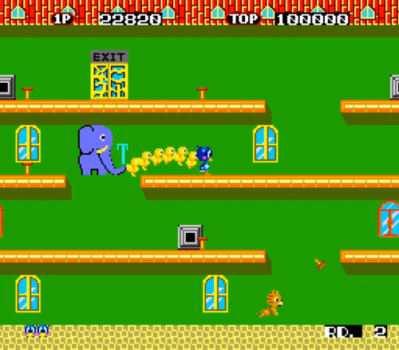

# Projeto Flicky
## FPRO/MIEIC, 2020/21
## Ian Italo Martins Gomes (up202000707)
## 1MIEIC07

### Objetivo

Criar um clone do Flicky (Mega Drive)

### Descrição

Flicky é um jogo de acção da Mega Drive com plataformas, em que o jogador é um pássaro que tem que pegar em passarinhos bebés e levá-los para a saída. Existem gatos que os tentam apanhar.

### UI

### Pacotes

- Pygame

### Tarefas

1. [ ] carregar os níveis
1. [ ] desenhar a matriz do nível
1. [ ] ler teclas e mover o personagem
1. [ ] coletar filhotes
1. [ ] inimigos
1. [ ] atingir inimigos 
1. [ ] verificar se jogador chegou à saida
1. [ ] entregar pontuação
